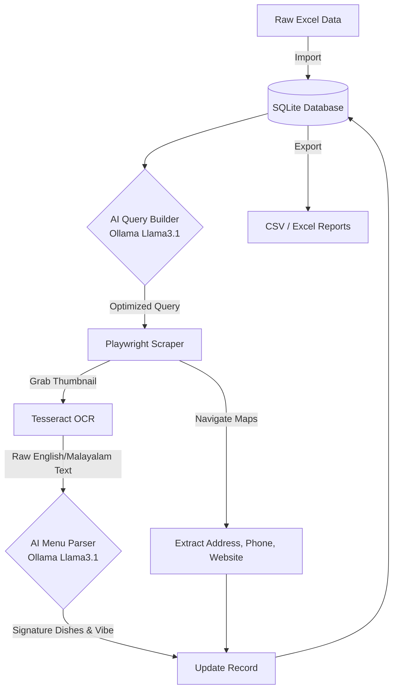

# 🌴 Kerala Toddy Shop Intelligence Pipeline


A **fully local, open-source, hybrid AI web scraping ecosystem** designed to autonomously extract and enrich structured information for ~4,500 Kerala Toddy Shops. This system completely avoids paid APIs and cloud billing by leveraging local Large Language Models (LLMs), headless stealth browser automation, and local Optical Character Recognition (OCR).

---

## ✨ Key Features

- **🧠 Local AI Query Builder:** Sanitizes messy location data and formulates high-precision search queries using local LLMs (via Ollama).
- **🕵️‍♂️ Stealth Browser Automation:** Uses Playwright to navigate Google Maps, bypass list-view traps, and extract rich data (Address, Rating, Reviews, Phone, Website).
- **👁️ Vision & OCR Pipeline:** Automatically downloads shop thumbnails/menus and uses Tesseract OCR to read English and Malayalam text.
- **🍛 Intelligent Menu Parsing:** Feeds raw OCR text back into the local LLM to intelligently extract *Signature Dishes* (e.g., Karimeen, Pork Roast) and summarize the shop's *Vibe*.
- **💾 Robust State Management:** Uses SQLite to track the exact geocoding and OCR status of every shop, making the pipeline 100% resumable and fault-tolerant.
- **📊 One-Click Export:** Instantly dump the SQLite database into polished Excel (`.xlsx`) and `.csv` files for manual review.

---

## 🏗️ System Architecture



---

## 🚀 Setup & Installation

### 1. Prerequisites
- **Python 3.10+** installed on your system.
- **[Ollama](https://ollama.com/)** running locally. Ensure you have pulled a model:
  ```powershell
  ollama run llama3.1:8b
  ```
- **[Tesseract OCR](https://github.com/UB-Mannheim/tesseract/wiki)** (Required for the menu extraction phase).
  - *Windows:* Install to the default location (`C:\Program Files\Tesseract-OCR\tesseract.exe`).

### 2. Environment Setup
Clone the repository and set up your virtual environment:

```powershell
# Create and activate a virtual environment
python -m venv .venv
.\.venv\Scripts\activate

# Install Python dependencies
pip install -r requirements.txt
pip install openpyxl  # Required for Excel exports

# Install Playwright Chromium binaries
playwright install chromium
```

### 3. Configuration
Review `config.py` in the root directory. By default, it expects:
- Your source CSV to be configured to your local path.
- Ollama to be running on `http://localhost:11434`.
- The Ollama model to be `llama3.1:8b` (adjustable in `ai/query_builder.py`).

---

## 🛠️ Usage Guide

### 🏃‍♂️ Running the Pipeline
To start the end-to-end extraction process, simply run the main script. It will automatically initialize the database, load your CSV, and begin processing the shops in batches.

```powershell
python main.py
```
> **Tip:** You can adjust the `batch_size` inside the `main()` function in `main.py` to control how many shops are processed per run. The system tracks progress in SQLite, so you can safely stop (Ctrl+C) and resume at any time.

### 📈 Exporting the Data
Whenever you want to review the enriched data, you can dump the SQLite database to CSV and Excel files in the `data/` directory.

```powershell
python utils\export_db.py
```

---

## 📁 Directory Structure

```text
Kerala-Shop-Intelligence/
│
├── ai/
│   └── query_builder.py       # Ollama integration for query sanitization
├── data/                      # Auto-generated output folder for CSV/Excel exports
├── database/
│   ├── db_setup.py            # SQLite schema and initialization logic
│   └── kerala_shops.sqlite    # The live persistent database
├── ocr/
│   └── menu_extractor.py      # Tesseract image downloading and parsing
├── scraper/
│   └── playwright_engine.py   # Headless Chromium Google Maps extraction
├── utils/
│   └── export_db.py           # Database export utility
├── .gitignore                 # Ignores venv, db files, and data exports
├── config.py                  # Global project configurations
├── main.py                    # The central orchestration script
└── requirements.txt           # Python package dependencies
```

---
*Built autonomously by Gemini CLI.*
